<a name="top"></a>

<p align="center">
  
</p>

<h1 align="center">👾 Lanetting — Web, Automation & AI Solutions</h1>

<p align="center">
  <em>Ing. Luis Antonio Lanetti R. · Systems Engineer · Automation & Technical SEO Specialist</em>
</p>

<p align="center">
  <a href="#english"><b>🇺🇸 English</b></a>
  ·
  <a href="#spanish"><b>🇪🇸 Español</b></a>
  <br/>
  <em>Read it in your language 👆 / Léelo en tu idioma 👆</em>
</p>

<br/>

<p align="center">
  
</p>

<p align="center">
  
</p>

<details>
  <summary><b>🔧 Bored? This is what that terminal is doing (TL;DR)</b></summary>

  <p align="center">It’s a live-loop console (Ubuntu style) that keeps firing my real scripts and the commands you see in every section title of my landing — <code>sudo su</code>, <code>./Professional_Journey.sh</code>, <code>sudo get_services</code>, <code>display --profiles</code>, <code>connect --init</code>… all around my floating stack. No tricks, just SMIL + SVG.</p>
</details>

<br/>

## 🧭 Table of contents / Índice

| 🇺🇸 English                                    | 🇪🇸 Español                                    |
|-------------------------------------------|-----------------------------------------------|
| [Who am I](#en-about)                     | [¿Quién soy?](#es-about)                      |
| [Services — `sudo get_services`](#en-services) | [Servicios — `sudo get_services`](#es-servicios) |
| [Stack — `stack --icons`](#en-stack)      | [Stack — `stack --icons`](#es-stack)          |
| [Projects — `projects --ls`](#en-projects) | [Proyectos — `projects --ls`](#es-proyectos) |
| [How we work — `process --workflow`](#en-process) | [Cómo trabajamos — `process --workflow`](#es-proceso) |
| [Contact — `connect --init`](#en-contact) | [Contacto — `connect --init`](#es-contacto)   |

---

<br/>

# 🇺🇸 English — English

<a name="english"></a>

> ```bash
> lanetting@ubuntu:~$ sudo su
> root@ubuntu:/home/lanetting# whoami
> Problem-solver who happens to write code — web apps, bots, servers and AI pipelines.
> ```

Hi! I'm **Luis Antonio Lanetti** (*Lanetting* for short 😄). I'm a **Systems Engineer** and I've spent 10+ years in the trenches of IT: securing bank infrastructure, migrating servers, shipping web apps, and automating everything that was boring enough to deserve it.

I don't sell "hours" — I sell **solutions that keep working while you sleep**. Whether it's a landing that should load in <1.5s, a bot that publishes your content without lifting a finger, or an AI pipeline that turns a voice-note into a polished article, I build it to be fast, reliable and easy to maintain.

---

<a name="en-about"></a>
## whoami — About

- 🎓 **Systems Engineer** — graduated in 2019, working in tech since 2017 (banking cybersecurity → global infra → AI in business workflows).
- 🛠️ **Generalist-doer**: I can go from Photoshop-style visuals → React app → Python scraper → Nginx server → Gemini pipeline without dropping the ball.
- 🚀 Currently consolidating over a decade of experience into modern, resilient infrastructure and cutting-edge automation.
- 🌎 Working worldwide (based in Venezuela 🇻🇪, fluent in ES/EN).

### 🎯 What I'm best at

| Field | One-liner (informal) |
|-------|----------------------|
| ⚡ Web performance | Slow sites lose money. I make them load fast, pass Core Web Vitals and rank better. |
| 🤖 Automation | If you do it twice a week by hand, it can be scripted. Bots, scrapers, schedulers, alerts. |
| 🧠 AI integrations | Gemini + Telegram + WordPress + your business = content on autopilot. |
| 🛡️ SysAdmin | Ubuntu/Debian servers, hardened, monitored, migrated with zero-downtime. |
| 📈 Technical SEO | Fix the root cause so Google crawls, indexes and features your site. |

---

<a name="en-services"></a>
## Services — `sudo get_services`

All the services from my [landing site](https://lanettix101.github.io/lanetting-web/), plus a few *(ahem…)* reasonable extra utilities that fit my stack. Click each one to unfold the details. ✅

<details>
  <summary><b>⚡ 1 · WordPress Speed Optimization (Core Web Vitals)</b> — <em>load in ~1.5s, score 90+</em></summary>

  A slow store kills sales. I do a deep audit and optimize the whole WordPress stack: server (OPcache, Redis, HTTP/3, Brotli), database, plugins, CSS/JS delivery, images and CDN.

  - **Timeline:** 2–4 business days
  - **Stack:** WordPress · Redis · LiteSpeed/Nginx · Cloudflare APO · WP-CLI · PageSpeed Insights · WebPageTest
  - **You get:** before/after report, full backups, cache tuning, and a guide to keep it fast forever.
</details>

<details>
  <summary><b>🕸️ 2 · Web Scraping & Process Automation Bots</b> — <em>data on tap, 24/7</em></summary>

  Custom scrapers and bots that extract, validate and deliver data into databases, sheets or APIs — with proxy rotation, anti-ban techniques and Docker deployment.

  - **Timeline:** 3–7 business days
  - **Stack:** Python · Playwright · BeautifulSoup · Scrapy · Docker · PostgreSQL · FastAPI
  - **You get:** documented source, initial validated dataset, cron/Docker scripts, Telegram/Discord alerts.
</details>

<details>
  <summary><b>📈 3 · Technical SEO & Google Search Console Audits</b> — <em>get indexed, get found, get paid</em></summary>

  Forensic crawl of your whole site: sitemap/robots/canónicos, redirect chains, crawl budget, JSON-LD structured data and the classic GSC *"Crawled – currently not indexed"* fixes.

  - **Timeline:** 3–5 business days
  - **Stack:** GSC · Screaming Frog · Sitebulb · Schema.org · Semrush/Ahrefs · log-file analysis
  - **You get:** prioritized audit doc, production-ready JSON-LD, clean robots + sitemap, GSC validation session.
</details>

<details>
  <summary><b>🖥️ 4 · Linux VPS Support & Zero-Downtime Migration</b> — <em>servers that never cry</em></summary>

  Provisioning, hardening and full migrations (sites, databases, emails) with rsync + low-TTL DNS so your business doesn't blink. Proactive monitoring and encrypted backups included.

  - **Timeline:** 1–3 business days
  - **Stack:** Ubuntu Server · Debian · Nginx · Docker · Bash · rsync · fail2ban · Hetzner/AWS · Certbot
  - **You get:** hardened server + security report, tested backup/restore scripts, 48h post-migration monitoring.
</details>

<details>
  <summary><b>🧠 5 · AI Pipelines · Gemini ⇄ Telegram ⇄ WordPress</b> — <em>send a voice-note → get a post</em></summary>

  Automated generative-AI workflows: Telegram bots wired to Google Gemini that transcribe, tag and publish polished content to WordPress/CRM with strict JSON schemas and anti-hallucination guardrails.

  - **Timeline:** 4–8 business days
  - **Stack:** Gemini API · Telegram Bot API · TypeScript/Python · WordPress REST API · Docker · Webhooks
  - **You get:** a working deployed bot, optimized prompt pipeline, WordPress/CRM connector, full docs.
</details>

<details>
  <summary><b>🛡️ 6 · WordPress Security & Malware Removal</b> — <em>from "infected" to "locked" in 24–48h</em></summary>

  Emergency cleanup for hacked WP sites (spam redirects, pharma hacks, crypto miners…), removal from Google Safe Browsing blacklists, and hardening against 100% of backdoors and web shells.

  - **Timeline:** 24–48 h (urgent)
  - **Stack:** WP-CLI · ClamAV · Cloudflare WAF · 2FA · PHP hardening · GSC
  - **You get:** clean site verified on blacklists, forensic report, hardening certificate, 30-day monitoring.
</details>

<details>
  <summary><b>🎨 7 · Creative Design & Interactive Web Apps</b> — <em>the fun stuff ✨</em></summary>

  Pixel-minded digital products: landing pages, portfolios, interactive tools, prize wheels, calculators, dashboards… with animations, micro-interactions and a strong "that's pretty!" factor. Web and/or cross-platform mobile.

  - **Examples:** creative pricing calculator (web + Flutter app), fortune wheel for stores, animation-heavy landing pages.
  - **Stack:** React · TypeScript · Tailwind · Motion · Chart.js · Vite · Flutter/Dart
</details>

<details>
  <summary><b>🤖 8 · AI & Business Automation Integrations</b> — <em>let the machines do the chore</em></summary>

  Connect AI to your daily operations: support chatbots, content autoposting, lead triage, report generation, image/audio processing, and any boring workflow that AI can handle better than a copy-paste session.

  - **Stack:** Gemini/OpenAI-style APIs · Telegram Bot API · n8n-style flows · Webhooks · Python/TS
</details>

<details>
  <summary><b>⚙️ 9 · Task Automation & Data Pipelines</b> — <em>cron is my love language</em></summary>

  Scheduled jobs, ETL-ish pipelines, Google Sheets sync, Instagram/Telegram monitoring, price tracking, notifications and alerting. Everything that repeats → I make it run by itself.

  - **Examples:** [Instagram → Telegram bot](#en-projects), [WordPress ↔ Telegram bridge](#en-projects).
  - **Stack:** Python · APScheduler · instaloader · httpx · API (TG/WP/GSC) · Docker · SQL/JSON/CSV
</details>

<details>
  <summary><b>🧩 10 · Custom & Tailor-Made Solutions</b> — <em>"can you build…?" yes. probably. let's talk</em></summary>

  Anything that doesn't fit in a box: bespoke internal tools, inventory/pricing systems, e-commerce toys, legacy code rescue, API integrations, chat-based control panels… If it's digital and it helps your business, I'll engineer it.

  - **Process:** honest scoping call → fixed roadmap → weekly demos → handover you can actually maintain.
</details>

> ```bash
> $ sudo apt install --yes trust; sudo lanetti --work
> ⚠ Note: I focus on a few solid clients at a time so every project gets real attention. 🧡
> ```

---

<a name="en-stack"></a>
## Stack — `stack --icons`

The icon soup floating in the header is **real usage**, not decoration. Here's what I actually ship with:

| **Area** | **Stack** |
|------|-------|
| 🟢 **Area** |  React  TypeScript  Vite  Tailwind  HTML5  WordPress  Node.js  PHP |
| 📱 **Mobile** |  Flutter  Dart  Android |
| ⚙️ **Automation** |  Python  FastAPI  Bash  Selenium  n8n  GitHub Actions |
| 🖥️ **Infra & Cloud** |  Ubuntu  Debian  Nginx  Docker  Vercel  Google Cloud  Redis  Hetzner |
| 🧠 **AI & Data** |  Gemini  Telegram  Ollama  Pandas  Chart.js  Grafana |
| 🎨 **UX/UI Design** |  Figma  Inkscape  Framer  Penpot  GIMP  Krita  Miro |

> ```bash
> $ stack --top
> react · typescript · python · flutter · wordpress · docker · nginx · bash · gemini · ollama
> ```

---

<a name="en-projects"></a>
## Projects — `projects --ls`

Every repo in this workspace was a real problem that became a working product. Here's the tour:

<details>
  <summary><b>🌐 lanetting-web</b> — <em>this services board (React + Vite + Tailwind + Motion)</em></summary>

  My bilingual landing/services site with a terminal-theme, EN/ES i18n, service detail pages and console-styled headings. Hosted on GitHub Pages and Vercel.

  **Stack:** React 19 · TypeScript · Vite · Tailwind v4 · Motion · React Router · Lucide
  › See this repo — you're reading its README right now 🙂
</details>

<details>
  <summary><b>🖥️ TrafficSimPro</b> — <em>traffic analytics & SEO-report simulator</em></summary>

  An interactive simulator of Google Analytics-style dashboards: organic/paid/bot traffic, countries, devices, clicks/impressions/sessions, Core Web Vitals… great for demos, mockups and SEO proposals.

  **Stack:** React · TypeScript · Chart.js · Vite
  **🔗 Sample:** [github.com/lanettix101/traffic-analytics-simulator](https://github.com/lanettix101/traffic-analytics-simulator)
</details>

<details>
  <summary><b>💐 calculadora-creativa</b> — <em>pricing calculator for creative crafts → web + mobile</em></summary>

  A tailored tool for a flower-crafts business: materials, per-flower parameters, extras, suggested sale price and image export. Built **twice**: as a web app (React + Tailwind + html2canvas) **and** as a native cross-platform app (Flutter → Android/iOS/Desktop).

  **Stack:** React 19 · Vite · Tailwind · html2canvas · **Flutter** · Dart · shared_preferences · share_plus
  **🔗 Sample:** [github.com/lanettix101/creative-pricing-calculator](https://github.com/lanettix101/creative-pricing-calculator)
</details>

<details>
  <summary><b>🔗 wp-tg-bridge</b> — <em>Telegram ⇄ WordPress bridge (bot in production)</em></summary>

  A Telegram bot that manages the whole content lifecycle of a WordPress site — publish, schedule, edit, delete, bulk media upload, SEO meta, reports and automatic notifications on new posts.

  **Stack:** Python 3.12 · python-telegram-bot · httpx · WordPress REST API · JSON storage
  **🔗 Sample:** [github.com/lanettix101/wordpress-telegram-bridge](https://github.com/lanettix101/wordpress-telegram-bridge)
</details>

<details>
  <summary><b>📸 instagram-telegram-bot</b> — <em>Instagram → Telegram monitoring bot</em></summary>

  Watches Instagram accounts and notifies a Telegram channel when posts drop — with per-account sessions, randomized user-agents, rate limiting, anti-ban logic and command controls (`/mode`, `/restart`).

  **Stack:** Python · instaloader · python-telegram-bot · APScheduler
  **🔗 Sample:** [github.com/lanettix101/instagram-telegram-bot](https://github.com/lanettix101/instagram-telegram-bot)
</details>

<details>
  <summary><b>🎡 prize-wheel-promo</b> — <em>fortune wheel for store promotions</em></summary>

  An interactive giveaway wheel for shops: weighted prizes, editable segments, winner modal with confetti and a Caracas-time clock. Quick, pretty, done.

  **Stack:** React · TypeScript · Vite · react-confetti
  **🔗 Sample:** [github.com/lanettix101/prize-wheel-promo](https://github.com/lanettix101/prize-wheel-promo)
</details>

<details>
  <summary><b>✒️ landing-con-k</b> — <em>branding & PR consultant portfolio</em></summary>

  A bilingual portfolio landing for Verónika con K — branding/PR consultant — with service carousel, biographic timeline, WhatsApp CTA and full dark/light theming.

  **Stack:** React · Vite · CSS
</details>

> ```bash
> $ projects --ls --icons
> 💻 web apps · 📱 flutter cross-platform · 🤖 bots · 🧠 ai-pipelines · 📊 dashboards · 🎨 creative
> ```
>
> *(Want a live demo of any of these? Ping me and I'll deploy a preview.)*

---

<a name="en-process"></a>
## How we work — `process --workflow`

1. **📞 Free honest call** — you explain the problem, I ask the ugly questions, we agree the goal.
2. **📋 Scope & quote** — fixed scope, fixed price (or weekly rate), clear timeline. No surprise invoices.
3. **👀 Build in sprints** — you see working pieces every couple of days, not a black box for a month.
4. **🚀 Ship & watch** — deploy, monitor, handover docs, and short post-launch support.
5. **🧡 Follow-up** — if something breaks, I don't vanish. We're partners after the handshake.

> Relax — communication is *más directa*: WhatsApp, Telegram or email, responses within a day.

---

<a name="en-contact"></a>
## Contact — `connect --init`

<p align="center">
  <table>
    <tbody>
      <tr>
        <td align="left">
          💌 <b>Email</b> → <a href="mailto:lanettix101@gmail.com">lanettix101@gmail.com</a><br/>
          📱 <b>WhatsApp</b> → <a href="https://wa.me/573103032400">wa.me/573103032400</a><br/>
          ✈️ <b>Telegram</b> → <a href="https://t.me/luiggilr">@luiggilr</a><br/>
          📅 <b>Book a call</b> → <a href="https://calendly.com/lanettix101/30min">calendly.com/lanettix101/30min</a>
        </td>
        <td align="left">
          📸 <b>Instagram</b> → <a href="https://instagram.com/lanetting_">@lanetting_</a><br/>
          💼 <b>LinkedIn</b> → <a href="https://www.linkedin.com/in/luis-lanetti/">in/luis-lanetti</a><br/>
          💼 <b>Upwork</b> → <a href="https://www.upwork.com/freelancers/~01eee7a32f933b7192">profile</a><br/>
          🧢 <b>Contra</b> → <a href="https://contra.com/luis_antonio_lanetti_kl77nmhr/services?r=luis_antonio_lanetti_kl77nmhr">profile</a><br/>
          ⚡ <b>Legiit</b> → <a href="https://legiit.com/lanetting">lanetting</a>
        </td>
      </tr>
    </tbody>
  </table>
</p>

> ```bash
> $ connect --init --now
> [✓] connection established — let's build something great 🚀
> ```

---

<br/>

# 🇪🇸 Español — Spanish

<a name="spanish"></a>

> ```bash
> lanetting@ubuntu:~$ sudo su
> root@ubuntu:/home/lanetting# whoami
> Resolutor de problemas que, de paso, escribe código — apps web, bots, servidores y pipelines de IA.
> ```

¡Hola! Soy **Luis Antonio Lanetti** (o *Lanetting* para los cuates 😄). Soy **Ingeniero en Sistemas** y llevo 10+ años en las trincheras del IT: asegurando infraestructura bancaria, migrando servidores, publicando apps web y automatizando todo lo que era tan aburrido que merecía serlo.

No vendo "horas" — vendo **soluciones que siguen trabajando mientras tú duermes**. Ya sea un landing que cargue en <1.5s, un bot que publique tu contenido sin mover un dedo, o un pipeline de IA que convierte una nota de voz en un artículo pulido, lo construyo rápido, confiable y fácil de mantener.

---

<a name="es-about"></a>
## whoami — ¿Quién soy?

- 🎓 **Ingeniero en Sistemas** — graduado en 2019, en tecnología desde 2017 (ciberseguridad bancaria → infraestructura global → IA en flujos de negocio).
- 🛠️ **Hacedor generalista**: paso sin drama de lo visual (estilo Photoshop) → app React → scraper en Python → servidor Nginx → pipeline con Gemini.
- 🚀 Actualmente consolidando más de una década de experiencia en infraestructura moderna, resiliente y automatización de vanguardia.
- 🌎 Trabajo para todo el mundo (haciendo vida en Venezuela 🇻🇪).

### 🎯 En qué soy bueno

| Área | En una línea (informal) |
|------|--------------------------|
| ⚡ Rendimiento web | Las webs lentas pierden plata. Las hago cargar rápido, pasar Core Web Vitals y posicionar mejor. |
| 🤖 Automatización | Si lo haces dos veces a la semana a mano, se puede hacer con un script. Bots, scrapers, agendadores, alertas. |
| 🧠 Integraciones de IA | Gemini + Telegram + WordPress + tu negocio = contenido en piloto automático. |
| 🛡️ SysAdmin | Servidores Ubuntu/Debian, endurecidos, monitoreados y migrados con cero tiempos muertos. |
| 📈 SEO técnico | Arreglo la raíz para que Google rastree, indexe y destaque tu sitio. |

---

<a name="es-servicios"></a>
## Servicios — `sudo get_services`

Todos los servicios de mi [landing](https://lanettix101.github.io/lanetting-web/), más algunos *(ehem…)* extras accesibles que le quedan perfectos a mi stack. Haz clic en cada uno para desplegar el detalle. ✅

<details>
  <summary><b>⚡ 1 · Optimización de Velocidad en WordPress (Core Web Vitals)</b> — <em>carga en ~1.5s, puntuación 90+</em></summary>

  Una tienda lenta mata ventas. Hago una auditoría profunda y optimizo todo el stack de WordPress: servidor (OPcache, Redis, HTTP/3, Brotli), base de datos, plugins, entrega de CSS/JS, imágenes y CDN.

  - **Plazo:** 2 a 4 días hábiles
  - **Stack:** WordPress · Redis · LiteSpeed/Nginx · Cloudflare APO · WP-CLI · PageSpeed Insights · WebPageTest
  - **Recibes:** reporte antes/después, backups completos, caché afinada y guía para mantenerla rápida para siempre.
</details>

<details>
  <summary><b>🕸️ 2 · Web Scraping & Bots de Automatización de Procesos</b> — <em>datos a la mano, 24/7</em></summary>

  Scrapers y bots a medida que extraen, validan y entregan información a bases de datos, hojas de cálculo o APIs — con rotación de proxies, técnicas anti-bloqueo y despliegue en Docker.

  - **Plazo:** 3 a 7 días hábiles
  - **Stack:** Python · Playwright · BeautifulSoup · Scrapy · Docker · PostgreSQL · FastAPI
  - **Recibes:** código documentado, dataset inicial validado, scripts cron/Docker y alertas en Telegram/Discord.
</details>

<details>
  <summary><b>📈 3 · Auditorías de SEO Técnico & Google Search Console</b> — <em>que te encuentren, te indexen y te paguen</em></summary>

  Rastreo forense de todo tu sitio: sitemap/robots/canónicos, cadenas de redirecciones, crawl budget, datos estructurados JSON-LD y los clásicos arreglos de *"Rastreada: actualmente sin indexar"*.

  - **Plazo:** 3 a 5 días hábiles
  - **Stack:** GSC · Screaming Frog · Sitebulb · Schema.org · Semrush/Ahrefs · análisis de logs
  - **Recibes:** auditoría priorizada, JSON-LD listo para producción, robots + sitemap limpios y sesión de validación en GSC.
</details>

<details>
  <summary><b>🖥️ 4 · Soporte y Migración de Servidores & VPS Linux</b> — <em>servidores que nunca sufren</em></summary>

  Aprovisionamiento, endurecimiento y migraciones completas (sitios, bases de datos, correos) con rsync + DNS de TTL bajo para que tu negocio ni pestañee. Monitoreo proactivo y backups cifrados incluidos.

  - **Plazo:** 1 a 3 días hábiles
  - **Stack:** Ubuntu Server · Debian · Nginx · Docker · Bash · rsync · fail2ban · Hetzner/AWS · Certbot
  - **Recibes:** servidor endurecido + informe de seguridad, scripts probados de backup/restauración y 48h de monitoreo post-migración.
</details>

<details>
  <summary><b>🧠 5 · Pipelines de IA · Gemini ⇄ Telegram ⇄ WordPress</b> — <em>envía una nota de voz → obtén un artículo</em></summary>

  Flujos de IA generativa automatizados: bots de Telegram conectados a Google Gemini que transcriben, etiquetan y publican contenido pulido en WordPress/CRM, con esquemas JSON estrictos y protecciones anti-alucinación.

  - **Plazo:** 4 a 8 días hábiles
  - **Stack:** Gemini API · Telegram Bot API · TypeScript/Python · WordPress REST API · Docker · Webhooks
  - **Recibes:** bot desplegado y operativo, pipeline de prompts optimizado, conector con WordPress/CRM y documentación completa.
</details>

<details>
  <summary><b>🛡️ 6 · Seguridad WordPress & Limpieza de Malware</b> — <em>de "hackeado" a "blindado" en 24–48 h</em></summary>

  Limpieza de emergencia para sitios WP comprometidos (redirecciones spam, pharma hacks, mineros…), salida de listas negras de Google Safe Browsing y blindaje contra el 100% de backdoors y web shells.

  - **Plazo:** 24 a 48 h (urgente)
  - **Stack:** WP-CLI · ClamAV · Cloudflare WAF · 2FA · endurecimiento PHP · GSC
  - **Recibes:** sitio limpio y verificado en listas negras, informe forense, certificado de blindaje y 30 días de monitoreo.
</details>

<details>
  <summary><b>🎨 7 · Diseño Creativo & Apps Web Interactivas</b> — <em>lo divertido ✨</em></summary>

  Productos digitales con ojo para el diseño: landings, portafolios, herramientas interactivas, ruletas, calculadoras, dashboards… con animaciones, micro-interacciones y mucho "¡qué lindo quedó!". Web y/o móvil multiplataforma.

  - **Ejemplos:** calculadora creativa (web + app Flutter), ruleta de la fortuna para tiendas, landings con animaciones.
  - **Stack:** React · TypeScript · Tailwind · Motion · Chart.js · Vite · Flutter/Dart
</details>

<details>
  <summary><b>🤖 8 · Integraciones de IA & Automatización de Negocios</b> — <em>que las máquinas hagan la tarea</em></summary>

  Conecto IA a tus operaciones diarias: chatbots de soporte, autopublicación de contenido, clasificación de leads, generación de reportes, procesamiento de imagen/audio y cualquier flujo aburrido que la IA haga mejor que un copy-paste.

  - **Stack:** APIs estilo Gemini/OpenAI · Telegram Bot API · flujos estilo n8n · Webhooks · Python/TS
</details>

<details>
  <summary><b>⚙️ 9 · Automatización de Tareas & Pipelines de Datos</b> — <em>cron es mi lenguaje del amor</em></summary>

  Trabajos programados, pipelines ETL-lite, sincronización con Google Sheets, monitoreo de Instagram/Telegram, seguimiento de precios, notificaciones y alertas. Todo lo que se repite → lo hago correr solo.

  - **Ejemplos:** [bot Instagram → Telegram](#es-proyectos), [puente WordPress ↔ Telegram](#es-proyectos).
  - **Stack:** Python · APScheduler · instaloader · httpx · APIs (TG/WP/GSC) · Docker · SQL/JSON/CSV
</details>

<details>
  <summary><b>🧩 10 · Soluciones a la Medida</b> — <em>"¿me puedes construir…?" sí. probablemente. hablemos</em></summary>

  Todo lo que no cabe en una caja: herramientas internas a medida, sistemas de inventario/precios, juguetes de e-commerce, rescate de código heredado, integraciones de APIs, paneles de control por chat… Si es digital y ayuda a tu negocio, lo ingiero.

  - **Proceso:** llamada honesta de alcance → plan fijo → demos semanales → entrega que de verdad puedas mantener.
</details>

> ```bash
> $ sudo apt install --yes confianza; sudo lanetti --trabajar
> ⚠ Nota: me concentro en pocos clientes a la vez para que cada proyecto reciba atención real. 🧡
> ```

---

<a name="es-stack"></a>
## Stack — `stack --icons`

La sopa de iconos que flota en el encabezado es **uso real**, no decoración. Esto es con lo que realmente entrego:

| **Área** | **Stack** |
|------|-------|
| 🟢 **Área** |  React  TypeScript  Vite  Tailwind  HTML5  WordPress  Node.js  PHP |
| 📱 **Móvil** |  Flutter  Dart  Android |
| ⚙️ **Automatización** |  Python  FastAPI  Bash  Selenium  n8n  GitHub Actions |
| 🖥️ **Infra & Nube** |  Ubuntu  Debian  Nginx  Docker  Vercel  Google Cloud  Redis  Hetzner |
| 🧠 **IA & Datos** |  Gemini  Telegram  Ollama  Pandas  Chart.js  Grafana |
| 🎨 **Diseño UX/UI** |  Figma  Inkscape  Framer  Penpot  GIMP  Krita  Miro |

> ```bash
> $ stack --top
> react · typescript · python · flutter · wordpress · docker · nginx · bash · gemini · ollama
> ```

---

<a name="es-proyectos"></a>
## Proyectos — `projects --ls`

Cada repo de este workspace fue un problema real que se convirtió en un producto funcionando. El recorrido:

<details>
  <summary><b>🌐 lanetting-web</b> — <em>esta pizarra de servicios (React + Vite + Tailwind + Motion)</em></summary>

  Mi landing/sitio de servicios bilingüe con tema de consola, i18n EN/ES, páginas de detalle de cada servicio y encabezados estilo terminal. Alojado en GitHub Pages y Vercel.

  **Stack:** React 19 · TypeScript · Vite · Tailwind v4 · Motion · React Router · Lucide
  › Mira este repo — estás leyendo su README ahora mismo 🙂
</details>

<details>
  <summary><b>🖥️ TrafficSimPro</b> — <em>simulador de analytics de tráfico & reportes SEO</em></summary>

  Un simulador interactivo de dashboards estilo Google Analytics: tráfico orgánico/pago/bots, países, dispositivos, clicks/impresiones/sesiones, Core Web Vitals… ideal para demos, maquetas y propuestas SEO.

  **Stack:** React · TypeScript · Chart.js · Vite
  **🔗 Sample:** [github.com/lanettix101/traffic-analytics-simulator](https://github.com/lanettix101/traffic-analytics-simulator)
</details>

<details>
  <summary><b>💐 creative-pricing-calculator</b> — <em>calculadora de precios para artesanías → web + móvil</em></summary>

  Una herramienta a medida para un negocio de flores y manualidades: materiales, parámetros por flor, extras, precio sugerido de venta y exportación de imagen. Construida **dos veces**: como app web (React + Tailwind + html2canvas) **y** como app nativa multiplataforma (Flutter → Android/iOS/Desktop).

  **Stack:** React 19 · Vite · Tailwind · html2canvas · **Flutter** · Dart · shared_preferences · share_plus
  **🔗 Sample:** [github.com/lanettix101/creative-pricing-calculator](https://github.com/lanettix101/creative-pricing-calculator)
</details>

<details>
  <summary><b>🔗 wp-tg-bridge</b> — <em>puente Telegram ⇄ WordPress (bot en producción)</em></summary>

  Un bot de Telegram que administra todo el ciclo de vida del contenido en un sitio WordPress — publicar, programar, editar, eliminar, carga masiva de medios, meta SEO, reportes y notificaciones automáticas de publicaciones nuevas.

  **Stack:** Python 3.12 · python-telegram-bot · httpx · WordPress REST API · almacenamiento JSON
  **🔗 Sample:** [github.com/lanettix101/wordpress-telegram-bridge](https://github.com/lanettix101/wordpress-telegram-bridge)
</details>

<details>
  <summary><b>📸 instagram-telegram-bot</b> — <em>bot de monitoreo Instagram → Telegram</em></summary>

  Vigila cuentas de Instagram y avisa a un canal de Telegram cuando hay publicaciones nuevas — con sesiones por cuenta, user-agents aleatorios, límites de frecuencia, lógica anti-bloqueo y controles por comando (`/mode`, `/restart`).

  **Stack:** Python · instaloader · python-telegram-bot · APScheduler
  **🔗 Sample:** [github.com/lanettix101/instagram-telegram-bot](https://github.com/lanettix101/instagram-telegram-bot)
</details>

<details>
  <summary><b>🎡 prize-wheel-promo</b> — <em>ruleta de la fortuna para promociones en tiendas</em></summary>

  Una ruleta interactiva para sorteos en tiendas: premios ponderados, segmentos editables, modal de ganador con confeti y reloj en hora de Caracas. Rápida, bonita, lista.

  **Stack:** React · TypeScript · Vite · react-confetti
  **🔗 Sample:** [github.com/lanettix101/prize-wheel-promo](https://github.com/lanettix101/prize-wheel-promo)
</details>

<details>
  <summary><b>✒️ veronika-con-k-web</b> — <em>portafolio para consultora de branding & RRPP</em></summary>

  Un landing-portafolio bilingüe para Verónika con K — consultora de branding/PR — con carrusel de servicios, línea de tiempo biográfica, CTA de WhatsApp y theming oscuro/claro completo.

  **Stack:** React · Vite · CSS
</details>

> ```bash
> $ projects --ls --icons
> 💻 apps web · 📱 flutter multiplataforma · 🤖 bots · 🧠 pipelines de ia · 📊 dashboards · 🎨 creativo
> ```
>
> *(¿Quieres una demo en vivo de alguno de estos? Escríbeme y despliego una preview.)*

---

<a name="es-proceso"></a>
## Cómo trabajamos — `process --workflow`

1. **📞 Llamada honesta y gratis** — me cuentas el problema, hago las preguntas incómodas y fijamos la meta.
2. **📋 Alcance y presupuesto** — alcance fijo, precio fijo (o tarifa semanal), plazo claro. Sin facturas sorpresa.
3. **👀 Construcción en sprints** — ves piezas funcionando cada par de días, no una caja negra por un mes.
4. **🚀 Entrega y seguimiento** — despliegue, monitoreo, documentación de entrega y soporte corto post-lanzamiento.
5. **🧡 Post-cuidado** — si algo falla, no desaparezco. Somos socios después del apretón de manos.

> Tranquilo — la comunicación es directa: WhatsApp, Telegram o email, con respuesta en menos de un día.

---

<a name="es-contacto"></a>
## Contacto — `connect --init`

<p align="center">
  <table>
    <tbody>
      <tr>
        <td align="left">
          💌 <b>Email</b> → <a href="mailto:lanettix101@gmail.com">lanettix101@gmail.com</a><br/>
          📱 <b>WhatsApp</b> → <a href="https://wa.me/573103032400">wa.me/573103032400</a><br/>
          ✈️ <b>Telegram</b> → <a href="https://t.me/luiggilr">@luiggilr</a><br/>
          📅 <b>Agenda una llamada</b> → <a href="https://calendly.com/lanettix101/30min">calendly.com/lanettix101/30min</a>
        </td>
        <td align="left">
          📸 <b>Instagram</b> → <a href="https://instagram.com/lanetting_">@lanetting_</a><br/>
          💼 <b>LinkedIn</b> → <a href="https://www.linkedin.com/in/luis-lanetti/">in/luis-lanetti</a><br/>
          💼 <b>Upwork</b> → <a href="https://www.upwork.com/freelancers/~01eee7a32f933b7192">perfil</a><br/>
          🧢 <b>Contra</b> → <a href="https://contra.com/luis_antonio_lanetti_kl77nmhr/services?r=luis_antonio_lanetti_kl77nmhr">perfil</a><br/>
          ⚡ <b>Legiit</b> → <a href="https://legiit.com/lanetting">lanetting</a>
        </td>
      </tr>
    </tbody>
  </table>
</p>

> ```bash
> $ connect --init --ahora
> [✓] conexión establecida — construyamos algo increíble 🚀
> ```

---

<br/>

<p align="center">
  
</p>

<p align="center">
  <b><a href="#top">⬆️ Loop again / Repetir el bucle</a></b>
</p>

<p align="center">
  <sub>© 2026 Lanetting — <code>sudo reboot --keep-building 🛠️</code></sub>
</p>